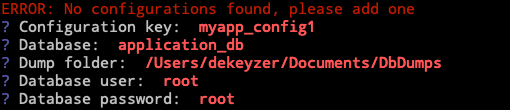
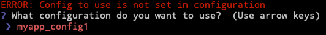
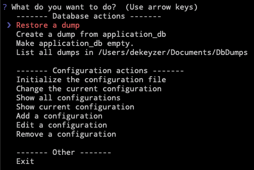

# JDUMP

A CLI written in python to manage mysql dumps.

## Requirements
* Python3
* mysql (with mysqladmin and mysqldump support)

## Setup
```
git clone git@github.com:JenoDK/jdump.git
cd jdump
# Activate virtual env if you want
pip install -r requirements.txt
```

## Usage
```
python jdump.py
```

#### First time
You will be prompted to initialize the configuration.

_Define configuration_<br/>

_Select which configuration to use, select the one you just created_<br/>


Your configuration will be stored in `<path_to_jdump>/config.yml`. You can see an example of what the config.yml should look like in `example_config.yml`

#### Not the first time
You can browse the menu and choose what you want to do, the choices are pretty obvious in what they will do.



After each action the menu wil open again, you can exit by selecting `Exit` or using <kdb>Control</kdb> + <kdb>C</kdb>


## Alias
I would recommend setting up an alias for the script.
```
alias jdump='python /Users/user/git/jdump/jdump.py'
```
or if you're using a virtualenv (in my case [virtualfish](https://github.com/excitedleigh/virtualfish))
```
alias jdump='vf activate jdump && python /Users/dekeyzer/git/jdump/jdump.py; vf deactivate'
```

## Contribute
```
git clone git@github.com:JenoDK/jdump.git
cd jdump
# Activate virtual env if you want
pip install -r requirements.txt
pip install -r requirements_dev.txt
```
